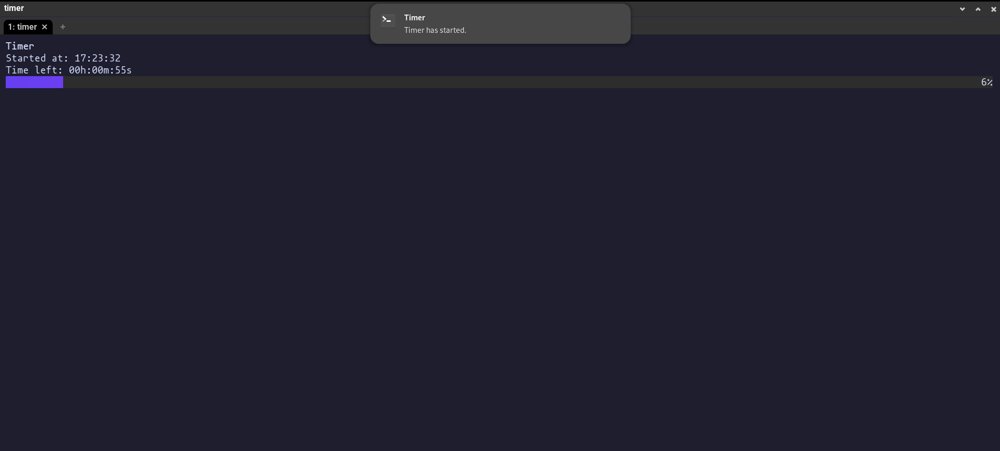

<p align="center">
	<h1 align="center">Timer</h1>
	<p align="center"> A colorful time progress display, akin to a sleep command but with a visually engaging progress report  </p>
</p>

## Screenshots



You will also get system notifications when the timer begins and ends:


To disable notifications, use the `--notify=false` flag.

## How to use

```
A colorful time progress display, akin to a sleep command but with a visually engaging progress report

Usage: timer [OPTIONS] <DURATION>

Arguments:
  <DURATION>  The duration of the timer. You can use the following formats:
                  - h (hours),
                  - m (minutes)
                  - s (seconds)
                  - ms (milliseconds).

                  If no unit is provided, seconds will be used.
                  Examples:
                  - timer 50 -> Runs a timer for 50 seconds (default).
                  - timer 45m -> Runs a timer for 45 minutes.
                  - timer 1h30m -> Runs a timer for 1 hour and 30 minutes.

Options:
  -n, --name <NAME>      A name for the timer.
      --notify=<NOTIFY>  Send a notification when the timer begins and ends. [default: true] [possible values: true, false]
  -f, --format <FORMAT>  The format of the timer. You can use the following formats:
                                 - 24h (24 hour format) (e.g. 23:59:59)
                                 - 12h (12 hour format) (e.g. 11:59:59 PM) [default: 24h] [possible values: 24h, 12h]
  -h, --help             Print help
  -V, --version          Print version
```
